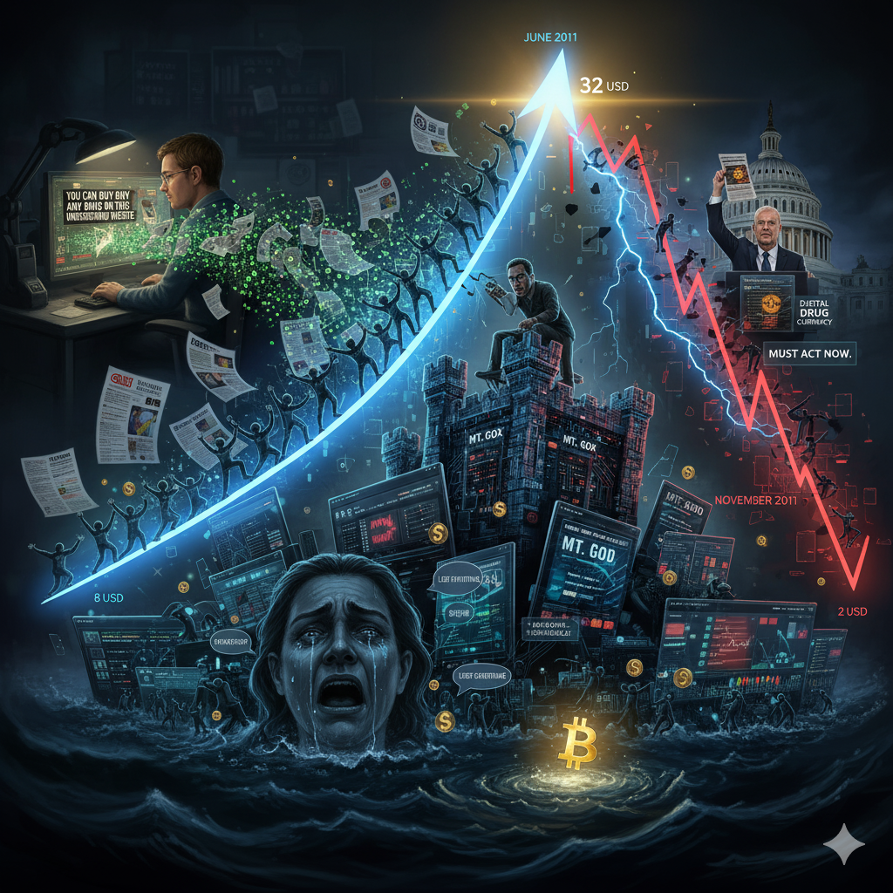

# 风起云涌：第一次泡沫

<picture>
  <source srcset="img_webp/13.webp" type="image/webp">
  
</picture>

> 💡 【核心内容】从Gawker震撼报道到媒体风暴，从FOMO狂欢到32美元巅峰，从Mt.Gox黑客事件到2美元深渊——比特币第一次完整的泡沫周期，见证了人性的贪婪与恐惧，也见证了一项技术的韧性与重生。
>
> 欢迎关注我的推特：[@bhbtc1337](https://twitter.com/bhbtc1337)
>
> 进入微信交流群请填表：[表格链接](https://forms.gle/QMBwL6LwZyQew1tX8)
>
> 文章开源在 GitHub：[Get-Started-web3](https://github.com/beihaili/Get-Started-web3)

## 一篇文章改变世界

2011年6月1日，纽约时间上午11点17分，曼哈顿第七大道230号的Gawker Media办公室里，29岁的科技记者Adrian Chen正准备发布一篇文章。他绝不会想到，这篇文章将成为比特币历史上最重要的转折点之一。

Adrian Chen并不是什么比特币专家，甚至在几周前，他还从未听说过这种"数字货币"。但作为一名专职挖掘互联网奇异故事的记者，他敏锐地嗅到了新闻的味道。一个朋友神秘地告诉他："有个网站可以买到任何你想要的毒品，而且政府抓不到。"

Chen花了两周时间深入调查。他下载了Tor浏览器，费尽心思找到了那个.onion地址，在丝绸之路上浏览了一圈。看到那些明码标价的大麻、可卡因、LSD，他震惊了。但更让他震惊的是，这个网站竟然运行得如此专业，完全不像他印象中的地下黑市。

更有趣的是那个叫"比特币"的支付方式。Chen查阅了大量资料才搞明白这是什么东西：一种完全数字化的货币，不受任何政府控制，交易记录无法被轻易追踪。"这简直就是毒贩子的完美货币。"他在心中想道。

## "毒品eBay"的爆炸性影响

下午1点30分，文章正式发布。标题简洁而震撼：**《The Underground Website Where You Can Buy Any Drug Imaginable》**。副标题更是直击要害：**"Welcome to Silk Road, the eBay for drugs"**。

Chen在文章中写道："需要几分钟来把你的美元兑换成比特币，这是该网站使用的数字货币。然后就像在任何电商网站一样简单——搜索你想要的毒品，选择卖家，付款，等待邮递员的到来。"

这篇文章的传播速度令人震惊。在24小时内，浏览量就突破了50万次。Twitter上的转发数超过1万次，Reddit上的讨论帖获得了数千条回复。更重要的是，"Bitcoin"这个词第一次大规模进入了普通人的视野。

Google搜索数据显示，"Bitcoin"的搜索量在6月1日后暴增了2000%。成千上万的人涌向BitcoinTalk论坛，想要了解这种神秘的"数字货币"。Mt.Gox交易所的注册量从每天几十个暴增到每天数千个。

但真正的地震还在后面。

## 媒体连锁反应

Gawker文章发布48小时后，一场媒体风暴正式形成。CNN、BBC、《纽约时报》、《华尔街日报》——几乎所有主流媒体都开始报道这个"网络毒品市场"和它使用的"加密货币"。

6月3日，CNN的财经频道首次专门报道了比特币。主持人Ali Velshi在节目中困惑地问道："这个比特币到底是什么东西？它是真钱吗？"

同一天，《时代周刊》网站发表了题为《Online Cash Bitcoin Could Challenge Governments, Banks》的文章，第一次从技术角度分析了比特币的革命性意义。

但更多的报道基调是负面的。《纽约时报》的标题是《A Currency's Shadowy Rise》，暗示比特币与犯罪活动密切相关。《华盛顿邮报》则直接称比特币为"Digital Drug Money"（数字毒品货币）。

这种媒体关注产生了强烈的正反馈效应：报道推高了价格，价格上涨又吸引了更多报道。比特币从此进入了一个前所未有的关注螺旋。

## 价格的疯狂之旅

媒体风暴的直接后果就是比特币价格的疯狂上涨。这不仅仅是数字的变化，更是人性贪婪与恐惧的生动展现。

6月1日文章发布时，比特币价格约为8.5美元。到了6月3日，价格已经涨到了16美元，两天内涨幅接近90%。但这只是开始。

## FOMO心理的蔓延

随着媒体报道的持续发酵，一种被后来称为"FOMO"（Fear Of Missing Out，害怕错过）的心理开始在散户投资者中蔓延。

来自加州的软件工程师Mark Thompson在后来的采访中回忆："我看到新闻说比特币一天涨了50%，立即觉得这是千载难逢的机会。我那天晚上就熬夜研究如何买比特币，第二天一早就用信用卡买了价值5000美元的比特币。"

类似的故事在2011年6月不断重复。社交媒体上充斥着"比特币让我一夜暴富"的传说，吸引了更多人加入这场投机游戏。

一位来自德州的退休教师Betty Williams甚至用退休金购买了价值2万美元的比特币。她后来说："我的儿子告诉我，比特币是未来的货币，错过了就再也没有机会了。"

这种FOMO情绪遵循着一个典型的模式：媒体触发→信息搜索→社交验证→冲动购买→情绪波动。成千上万的普通人，在完全不理解比特币技术原理的情况下，就投入了大量资金。

## 基础设施的不堪重负

随着用户数量的爆炸式增长，比特币的基础设施开始显露出严重问题。

Mt.Gox的创始人Mark Karpeles在巴黎的小公寓里，眼睁睁看着自己的网站被汹涌而来的用户流量击垮。服务器一次次宕机，客服邮箱被数万封邮件淹没，交易处理时间从几秒钟延长到几小时。

更糟糕的是，Karpeles发现自己完全没有准备好应对这种规模的增长。Mt.Gox原本只是他的一个业余项目，用的还是几年前为交换《魔法风云会》卡牌而搭建的旧代码。面对每天数千名新用户的涌入，系统已经超负荷运行。

"我每天只睡3-4个小时，"Karpeles后来回忆道，"不断地修补系统漏洞，处理用户投诉，但问题总是比解决方案来得更快。"

比特币网络本身也感受到了压力。网络交易量增长了10倍，确认时间延长，手续费开始上涨。一些小型节点因为带宽不足而掉线，网络的去中心化程度受到冲击。

## 32美元的历史巅峰

2011年6月8日，格林尼治时间下午2点17分，比特币价格达到了历史性的31.9099美元。这个精确到小数点后四位的数字，被永远载入了比特币历史。

从2月份的1美元到6月份的32美元，比特币用了不到4个月时间实现了3200%的涨幅。这种涨幅在金融历史上都是极其罕见的，即使是互联网泡沫时期的科技股也很少有如此表现。

当时的数据显示：
- 全网总市值：约2.1亿美元
- 24小时交易量：超过150万美元
- 活跃地址数：超过3万个
- 全球媒体报道：当日有超过500家媒体报道比特币

在BitcoinTalk论坛上，用户们一片欢腾。一位名叫"early_adopter"的用户兴奋地写道："我们做到了！比特币已经不再是极客的玩具，而是一个真正的金融现象！历史将记住这一刻！"

但很少有人意识到，这个辉煌的时刻，实际上是暴风雨前的宁静。

## 暴风雨前的宁静

就在比特币价格创下历史新高的时候，一些警觉的观察者已经嗅到了危险的味道。

著名的比特币早期开发者Jeff Garzik在论坛上写道："这种价格上涨速度是不可持续的。我担心我们正在经历一个经典的投机泡沫，而泡沫迟早会破裂。"

经济学家Nouriel Roubini在Twitter上评论："比特币的价格走势完全符合典型泡沫的特征。当人们开始谈论'范式转变'和'这次不同'时，就是泡沫破裂的时候。"

更令人担忧的是，大量新用户对比特币的技术原理一无所知。一项调查显示，在新注册的Mt.Gox用户中，超过80%的人无法正确解释什么是区块链，超过60%的人甚至不知道如何安全保存比特币钱包。

这种知识与投资的严重不匹配，为即将到来的崩盘埋下了伏笔。

## 黑客攻击：泡沫破裂的导火索

2011年6月19日，东京时间上午9点15分，一个改变比特币历史的电话响起。

Mark Karpeles被急促的铃声惊醒，电话那头传来技术人员惊恐的声音："老板，出大事了！我们被黑客攻击了，而且攻击规模史无前例！"

这次攻击的范围之广、破坏之大，远超任何人的想象：

**用户数据泄露**：超过6万个用户账户的信息被窃取，包括用户名、邮箱地址和加密后的密码。

**比特币被盗**：黑客直接从Mt.Gox的热钱包中窃取了25,000个比特币，按当时价格价值约80万美元。

**交易数据篡改**：更恶劣的是，黑客还篡改了交易数据，人为制造了大量虚假交易，试图操纵市场价格。

**系统全面瘫痪**：为了防止进一步损失，Mt.Gox被迫关闭全部交易功能，整个平台完全停止运营。

最令人愤怒的是，黑客还在BitcoinTalk论坛上公开炫耀，发布了部分被窃取的用户数据，并嘲讽地写道："这只是开始，更多的惊喜还在后面。"

## 恐慌抛售：价格自由落体

Mt.Gox黑客事件的消息传出后，整个比特币市场陷入了前所未有的恐慌。在其他还能正常运行的小交易所上，比特币价格开始了史诗级的崩盘：

**6月19日**：从32美元跌至25美元（-22%）
**6月20日**：从25美元跌至15美元（-40%）  
**6月21日**：从15美元跌至10美元（-33%）
**6月22日**：继续跌至5美元（-50%）

但这还不是结束。恐慌情绪继续蔓延，价格继续下跌，最终在7月中旬触及了2.05美元的低点。相比32美元的峰值，跌幅高达93.6%。

这种跌幅的残酷性在金融历史上都是极其罕见的。即使是1929年的股市大崩盘，也很少有单一资产出现如此剧烈的下跌。

## 散户的血泪史

对于那些在高位买入的散户投资者来说，这场崩盘是一个残酷的现实教育课。

那位用信用卡买入5000美元比特币的软件工程师Mark Thompson，在后来的采访中痛苦地回忆："我眼睁睁看着自己的5000美元变成了500美元。那种感觉就像是在看自己的房子着火，却什么都做不了。我妻子知道后和我大吵了一架，差点要离婚。"

德州的退休教师Betty Williams更是损失惨重。她的2万美元退休金最终只剩下了2000美元。"我一个晚上老了10岁，"她后来说，"我本来想给孙子留点钱的，结果把自己的养老钱都搭进去了。"

在BitcoinTalk论坛上，类似的血泪故事比比皆是：

"我借钱买的比特币，现在不知道怎么还债..."
"我把孩子的大学学费都投进去了，现在怎么办..."
"我卖掉了车子买比特币，现在车没了钱也没了..."

这些故事展现了投机狂热的残酷代价，也为后来的投资者提供了血的教训。

## 媒体态度的180度转变

更具讽刺意味的是媒体态度的戏剧性转变。

**6月初的报道标题**：
- "比特币：数字时代的黄金"（CNN）
- "神秘数字货币创造投资奇迹"（BBC）  
- "比特币：未来货币的雏形"（《时代周刊》）

**6月底的报道标题**：
- "比特币泡沫破裂，投资者血本无归"（CNN）
- "数字货币骗局终于露出真面目"（BBC）
- "比特币：一个注定失败的实验"（《时代周刊》）

这种媒体态度的极端转变，完美展现了金融市场中的"羊群效应"。当价格上涨时，一切都是利好消息；当价格下跌时，一切都是利空因素。记者们似乎忘记了，他们报道的仍然是同一项技术，同一个网络。

## 政治风暴：参议员的怒火

Gawker文章发表后仅仅4天，美国政坛就掀起了轩然大波。6月6日，美国参议院民主党领袖Chuck Schumer和共和党参议员Joe Manchin联名致信缉毒署（DEA）和司法部长，要求立即调查并关闭丝绸之路。

在国会山的新闻发布会上，Schumer愤怒地挥舞着打印出的丝绸之路网页，声嘶力竭地说："这个网站是现代技术被滥用的最明显例子！它就像是21世纪的毒品批发市场！我们必须立即采取行动！"

他将比特币描述为"网络洗钱机"，要求政府"摧毁这种数字货币"。Manchin则补充道："这种所谓的货币完全脱离了政府监管，为犯罪分子提供了完美的工具。我们不能让这种情况继续下去！"

这种政治压力对比特币价格产生了直接影响。每当有关监管的负面新闻出现，价格就会进一步下跌。市场开始担心，政府可能会采取严厉措施禁止比特币。

## FBI的正式介入

政治压力很快转化为执法行动。2011年6月15日，FBI正式启动了对丝绸之路和比特币的调查，代号"Operation Marco Polo"（马可·波罗行动）。

FBI网络犯罪部门很快发现，他们面对的是前所未有的技术挑战：

**Tor网络的匿名性**：传统的网络追踪技术完全失效，无法定位服务器的真实位置。

**比特币的伪匿名性**：虽然所有交易都记录在区块链上，但将比特币地址与真实身份关联起来极其困难。

**国际管辖权问题**：用户遍布全球，涉及多个国家的法律协调问题。

**技术人才短缺**：FBI缺乏足够的技术专家来理解这种新型数字技术。

FBI网络犯罪部门主管在内部备忘录中坦率地写道："我们面对的是一个全新的挑战。传统的执法手段在这里几乎完全无效，我们需要重新思考如何应对数字时代的犯罪。"

这种执法困境也从侧面证明了比特币技术的先进性和抗审查能力。

## 社区的分裂与坚持

这场危机在比特币社区内部引发了深刻的分歧。

**30%的用户选择完全离开**：他们大多是被媒体吸引进来的投机者，对比特币的技术原理和长期愿景缺乏深度理解。价格的暴跌让他们彻底失去信心。

**40%的用户选择观望**：他们暂停了交易，但仍然关注比特币的发展。这部分人构成了未来牛市的重要基础。

**30%的用户选择坚持**：这部分人主要是技术极客和深度信仰者，他们相信比特币的长期价值。许多人甚至在低价时加仓买入。

Hal Finney作为比特币的第一个信徒，在这个艰难时刻写道："价格的涨跌不能改变比特币的本质。它仍然是一个革命性的技术创新，一个真正去中心化的货币系统。短期的投机行为不应该掩盖其长期价值。我相信，那些真正理解比特币的人不会被这种波动吓倒。"

Gavin Andresen作为比特币的主要开发者，也发表了类似观点："我们正在经历的不是比特币的失败，而是成长的痛苦。每一次危机都让我们更加强大，每一次考验都让技术更加成熟。"

## 技术进步的推动力

讽刺的是，这场危机也成为技术进步的重要推动力。

**交易所安全改进**：Mt.Gox事件后，几乎所有交易所都开始重视安全防护。多重签名、冷存储、定期安全审计成为行业标准。

**钱包软件发展**：更多安全易用的钱包软件开始出现，如Electrum、MultiBit等，为用户提供更好的自主保管选择。

**区块链分析技术**：执法部门的需求推动了区块链分析技术的发展，Chainalysis、Elliptic等专业公司开始萌芽。

**隐私保护技术**：作为对监管压力的回应，CoinJoin等混币技术开始被研究，为后来的隐私币奠定了基础。

**教育资源增加**：社区开始意识到教育的重要性，大量科普文章、视频教程和技术文档开始出现。

## 理性回归：价值发现的过程

泡沫破裂后，比特币进入了一个痛苦但必要的价值发现过程。

那些纯粹基于FOMO和媒体热度的投机价值迅速蒸发。从32美元到2美元的跌幅，很大程度上就是这种非理性繁荣的清算。

但即使在最低点，比特币的价格也没有归零。这说明它确实具有某种内在价值：

**技术价值**：作为解决双重支付问题的去中心化系统，比特币代表了货币技术的重大突破。

**网络价值**：即使在危机中，比特币网络仍然在正常运行，证明了其韧性和可靠性。

**稀缺价值**：2100万的总量限制和每四年减半的机制，创造了可预期的通缩模型。

**自由价值**：抗审查和伪匿名特性对全球用户具有独特吸引力，特别是那些生活在金融管制严格地区的人。

## 历史人物的命运转折

这次泡沫深刻改变了许多关键人物的命运轨迹。

**Mark Karpeles的转折点**：从被社区视为英雄的交易所创始人，到因安全事件备受质疑的争议人物。这次黑客攻击成为他后来更大悲剧的预演。

**Roger Ver的机会**：这位后来被称为"比特币耶稣"的早期投资者，正是在价格低谷时大量买入，为他后来的财富积累奠定了基础。

**Adrian Chen的意外影响**：这位写下那篇改变历史文章的记者，在后来的采访中表示自己完全没有预料到会引发如此巨大的影响。他后来成为了区块链技术的关注者和支持者。

## 深层启示：创新扩散的必然过程

2011年的比特币泡沫为我们提供了观察技术创新如何被社会接受的绝佳案例。

这次泡沫完美展现了创新扩散的经典S型曲线：
- **早期采用者阶段**（2009-2010）：技术极客和密码朋克
- **早期多数阶段**（2011-2012）：媒体报道引发的大众关注  
- **后期多数阶段**（2013-2017）：机构和主流用户开始接受
- **落后者阶段**（2018-现在）：剩余群体的逐步接受

2011年的泡沫标志着比特币从早期采用者向早期多数用户扩散的过程。

它也验证了Gartner炒作周期理论：
1. **技术触发**：比特币的技术创新
2. **期望膨胀的峰值**：媒体报道引发的过度期望  
3. **幻灭的低谷**：价格崩盘和负面新闻
4. **启蒙的斜坡**：理性认识技术的价值和局限
5. **生产力的高原**：技术成熟和广泛应用

2011年的泡沫破裂标志着比特币进入"幻灭的低谷"阶段，为后来的理性发展铺平了道路。

## 泡沫的价值：破坏中的建设

当我们站在历史的高点回望2011年的那个夏天，会发现这场看似灾难性的泡沫，实际上完成了几个关键的历史任务：

**知名度的建立**：让比特币从极客圈子走向大众视野，虽然初期伴随着负面形象，但为后来的正名奠定了基础。

**用户基础的筛选**：驱离了纯粹的投机者，留下了真正的信仰者，为后续发展提供了更坚实的社区基础。

**技术体系的强化**：暴露了各种技术和管理问题，促进了整个生态系统的改进和成熟。

**价值认知的深化**：让人们开始区分短期投机价值和长期技术价值，形成了更理性的认知框架。

**监管环境的明确**：让政府开始正视加密货币的存在，为后续的政策制定和监管框架建立提供了起点。

更重要的是，这次泡沫证明了比特币的韧性。即使在最严重的危机中，网络依然正常运行，社区依然保持活跃，技术依然在进步。这种韧性成为后来投资者和开发者信心的重要来源。

## 时代的启蒙：从狂热到理性

Hal Finney在泡沫破裂后写下的一段话，现在看来具有先知般的洞察力：

"今天的崩盘不是结束，而是开始。那些真正理解比特币价值的人不会被短期的价格波动吓倒。他们知道，真正的革命需要时间，真正的价值需要经受考验。我们正在见证的不是一个技术的死亡，而是一个新时代的诞生。这个从32美元跌到2美元的数字，有一天会让后来的人们感到不可思议。"

十多年后的今天，当比特币价格已经超过10万美元时，我们才真正理解了Finney话中的深意。那些在2美元低点坚持的人，不仅见证了历史上最伟大的财富创造过程之一，更重要的是，他们参与了人类货币史上最重要的实验。

2011年夏天的比特币泡沫，不仅仅是金融史上的一个事件，更是人类向数字化未来迈进过程中的重要里程碑。它提醒我们，所有伟大的创新都需要经受考验，所有重要的变革都伴随着痛苦，但正是这些考验和痛苦，铸就了真正持久的价值。

这次泡沫像是比特币的成人礼——在经历了媒体的狂欢、市场的疯狂、价格的崩盘、社区的分裂之后，比特币终于从一个技术实验成长为一个成熟的金融创新。它学会了面对质疑，学会了承受压力，学会了在废墟中重建。

而那些见证了这一切的人，无论是坚持者还是离开者，都成为了这段历史的一部分，成为了人类货币演进史上的重要见证者。

---

*在2011年6月8日比特币价格达到32美元的峰值时，如果有人预言它会在同一年跌到2美元，然后在13年后涨到超过10万美元，几乎没有人会相信。但历史的奇妙就在于，它总是超出人们最疯狂的想象。*

---

<a href="https://github.com/beihaili/Get-Started-with-Web3">🏠 返回主页</a> | 
<a href="https://twitter.com/bhbtc1337">🐦 关注作者</a> | 
<a href="https://forms.gle/QMBwL6LwZyQew1tX8">📝 加入交流群</a>

