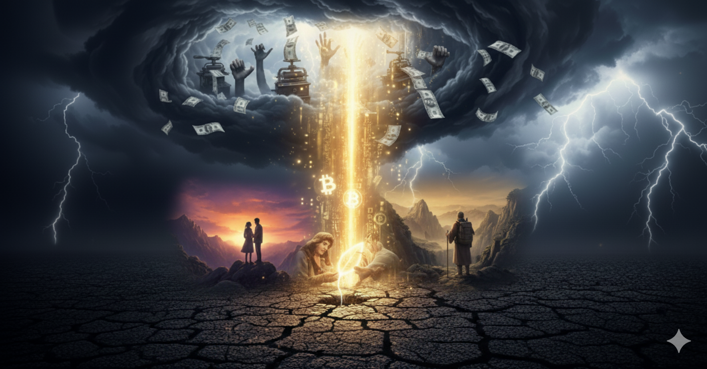

# Stories about Bitcoin - Prologue: A Beam of Idealistic Light Piercing Reality

> 💡 Deeply understand the history, philosophy, and technology behind Bitcoin. This is a story about how ideals pierce through reality. Through this series, you'll learn the causes and effects of Bitcoin's birth, and how it transformed from a crazy idea into a world-changing force.
> 
> Follow me on Twitter: [@bhbtc1337](https://twitter.com/bhbtc1337)
> 
> Join our WeChat discussion group: [Form Link](https://forms.gle/QMBwL6LwZyQew1tX8)
> 
> Open source on GitHub: [Stories-about-Bitcoin](https://github.com/beihaili/Stories-about-Bitcoin)
> 

Not long ago, I attended a wedding—a very special wedding.

It was held on a mountaintop, with no master of ceremonies, no noisy band, and not even a lavish banquet. The guests were all young friends of ours. We simply stood there, watching the last rays of sunset pierce through the clouds, casting golden light behind the bride and groom, and across each of our faces. The world was silent, save for the wind and our heartbeats.

As the bride recited her vows, looking into the groom's eyes, she said something that struck me to my core:

> "He is someone who 'lives like a human being.'"

"Lives like a human being"—this most simple praise carried the weight of a thousand pounds. It means not speaking against one's conscience, not doing what one doesn't believe in, and not bowing to hypocrisy and mediocrity. Looking at my friend, this groom who in my eyes also "lives like a human being," standing in that vast golden glow, he seemed like the embodiment of an ideal itself.

Yet, a familiar doubt still swept across my heart like the cold wind on a mountain peak. I knew him too well, and I knew this world too well. For this ideal of "living like a human being," how many compromises and maneuvers had he made in places we couldn't see? Would the purity of that ideal inevitably be stained with dust when planted in the soil of reality?

This thought reminded me of another person—Xu Xiake.

At the end of "Those Things in the Ming Dynasty," Dang Nian Ming Yue didn't continue writing about Li Zicheng's defeat or the Qing Dynasty's entry into the Central Plains. Instead, he dedicated his final tribute to this solitary traveler. The author said that all the eternal achievements and everlasting fame cannot compare to "living your life the way you like."

But I can't help wondering: when Xu Xiake trekked through the wilderness, surviving on wild vegetables and dry rations, did he ever have moments of wavering? When he stood alone, facing the grandeur of nature and his own insignificance, what sustained him—besides that burning passion—was there also an unknown bitterness and helplessness? The most sublime ideals are often born from the cruelest realities.

We praise ideals precisely because they are like diamonds—brilliant crystals formed under immense pressure from reality.

From my friend's wedding to Xu Xiake's travels, I saw a common, eternal human longing:

> We yearn to live authentically, to pursue what we love, but we must also face the gravitational pull of reality.

And this is exactly why I finally decided to pick up my pen and write "Stories about Bitcoin."

---

## Bitcoin and Ideals

What is Bitcoin? Setting aside the complex code and noisy price charts, its core resonates profoundly with that mountaintop wedding and Xu Xiake's distant journeys.

It is a form of extreme idealism.
A value bearer that is not controlled by any single entity and can be owned by everyone. Its very existence proclaims a possibility: you can preserve and transfer your own value without depending on any intermediary. This is a thorough, almost philosophical freedom.

But it is also a form of down-to-earth realism.
It didn't remain in papers or manifestos but operates vividly in this imperfect world, using cold algorithms and decentralized consensus to build a solid, indestructible fortress. It is rooted in the soil of reality, yet blooms an ideal flower.

I often wonder: if Xu Xiake had possessed the confidence that Bitcoin provides, would his travels have contained less wandering and more magnificent landscapes? If my friend could have such unwavering value support, could his path of "living like a human being" be walked more purely, with his head held higher?

I don't know the exact answer, but I'm willing to believe.

Because what truly moves me about Bitcoin is not the myth of wealth, but a kind of confidence. It's like a beam of light that illuminates the gap between ideals and reality, then tells all those with idealistic hearts:

> "You can do it. Your ideals don't have to remain just ideals."

So in this book, I want to share with you everything that happened before and after this beam of idealistic light pierced through reality.

You will read about how a group of idealistic madmen, technology fanatics, and anarchists used code as their chisel to carve an ideal prototype from the hard stone of the real world.

You will also see how, when this ideal creation was placed in the center of humanity's public square, it became painted with the most authentic colors: some used it to hide their tracks in black markets, while others used it to protect their ideals; some surrendered their private keys out of fear, seeking custody, while others held their keys and fought against the entire world; countless speculators and fraudsters wove myths of overnight riches around it, along with chaotic aftermaths.

These are all stories of Bitcoin. It is both an epic of idealists and a stage for realists. I hope these stories will help you understand Bitcoin while also seeing ourselves more clearly, and the imperfect yet hopeful era we live in.

So let's begin.

---

<a href="../">🏠 Return to Homepage</a> | 
<a href="https://twitter.com/bhbtc1337">🐦 Follow Author</a> | 
<a href="https://forms.gle/QMBwL6LwZyQew1tX8">📝 Join Discussion Group</a>

