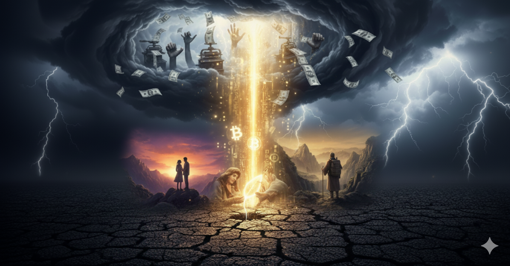

# Prologue: A Beam of Idealism Illuminating Reality

Not long ago, I attended a wedding — a rather extraordinary one.
It was held on a mountaintop. No emcee, no rowdy band, not even an extravagant banquet. The guests were all young friends of ours. We simply stood there, watching the last light of sunset pierce through the clouds, draping the bride and groom in golden radiance — and touching every one of our faces. Heaven and earth fell silent; there was only the wind and our heartbeats.

As the bride read her vows, she looked into the groom's eyes and said something that struck me like a thunderclap:

> "He is someone who lives like a true human being."

"Lives like a true human being" — the most unadorned praise imaginable, yet it carried the weight of the world. It meant never speaking against your conscience, never acting against your beliefs, never bowing to pretense and mediocrity. Looking at my friend — the groom who, in my eyes, equally "lives like a true human being" — bathed in that sky of golden light, I felt I was seeing the very embodiment of an ideal.

And yet, a familiar sliver of doubt crept across my heart like the cold wind on that mountaintop. I knew him too well. I knew the world too well. For this ideal of "living like a true human being," how many compromises and negotiations had he endured in places we couldn't see? Would that pure ideal inevitably gather a little dust upon the soil of reality?

That thought reminded me of another man — Xu Xiake.

At the end of *"Those Things in the Ming Dynasty,"* the author Dangnian Mingyue did not continue with Li Zicheng's defeat, nor did he dwell on the Manchu conquest. Instead, he reserved his final tribute for this solitary traveler. The author wrote that all the empires built to last a thousand years, all the fame meant to echo through eternity — none of it compares to "spending your life the way you love."

But I can't help wondering: when Xu Xiake was trekking through the wilderness, surviving on wild herbs and dry rations, did he ever waver, even for a moment? When he stood alone before nature's grandeur, confronting his own insignificance, was it only burning passion that sustained him — or was there also an unseen measure of bitterness and helplessness? The loftiest ideals are often born from the harshest realities.

We celebrate ideals precisely because, like diamonds, they are brilliance forged under immense real-world pressure.

From my friend's wedding to Xu Xiake's travels, I saw a universal, eternal human longing:

> We long to live authentically, to pursue what we love — yet we must contend with the gravity of reality.

And this is the entire reason I finally picked up my pen to write *Stories about Bitcoin.*

---

What does Bitcoin have to do with that wedding?

You'd probably say nothing at all. But let me tell you a few things first.

In 2022, Canadian truckers protested mandatory vaccine requirements, driving their rigs right up to Parliament Hill. Over a hundred thousand people donated to their cause online. The government invoked the Emergencies Act — never once used since it was passed in 1988 — and froze the bank accounts of protesters and donors alike. Ten million Canadian dollars in crowdfunding, frozen just like that.

But someone raised 21 BTC through Bitcoin, loaded them into paper wallets inside envelopes, and handed them to the truckers one by one. When the court issued a freezing order to Nunchuk, a Bitcoin wallet provider, Nunchuk wrote back: "We do not hold user keys and cannot freeze anyone's assets. When the Canadian dollar becomes worthless, we will be here to serve you too."

In 2020, young Nigerians launched the #EndSARS protest against police brutality. The organizers' payment channels were shut down with a single phone call from the central bank. They spent one day setting up Bitcoin payments and received over a hundred thousand dollars in donations within two weeks. This time, no one could make a phone call to shut it down.

In Afghanistan, a young woman earned 2.5 bitcoins through programming work. When the Taliban came, she had no bank deposits to transfer, no bank that could help her. But she had memorized twelve English words — her seed phrase. She carried those twelve words to Germany and started a new life.

What truly moves me about Bitcoin has never been the wealth mythology — it's the backbone. The backbone of knowing "you can't freeze my money." The bride on that mountaintop praised the groom for "living like a true human being." But when your money can be frozen with a single phone call, those words aren't quite so simple anymore.

This book is about where that backbone comes from. Starting in 1976, with a prophecy from a Nobel laureate.
