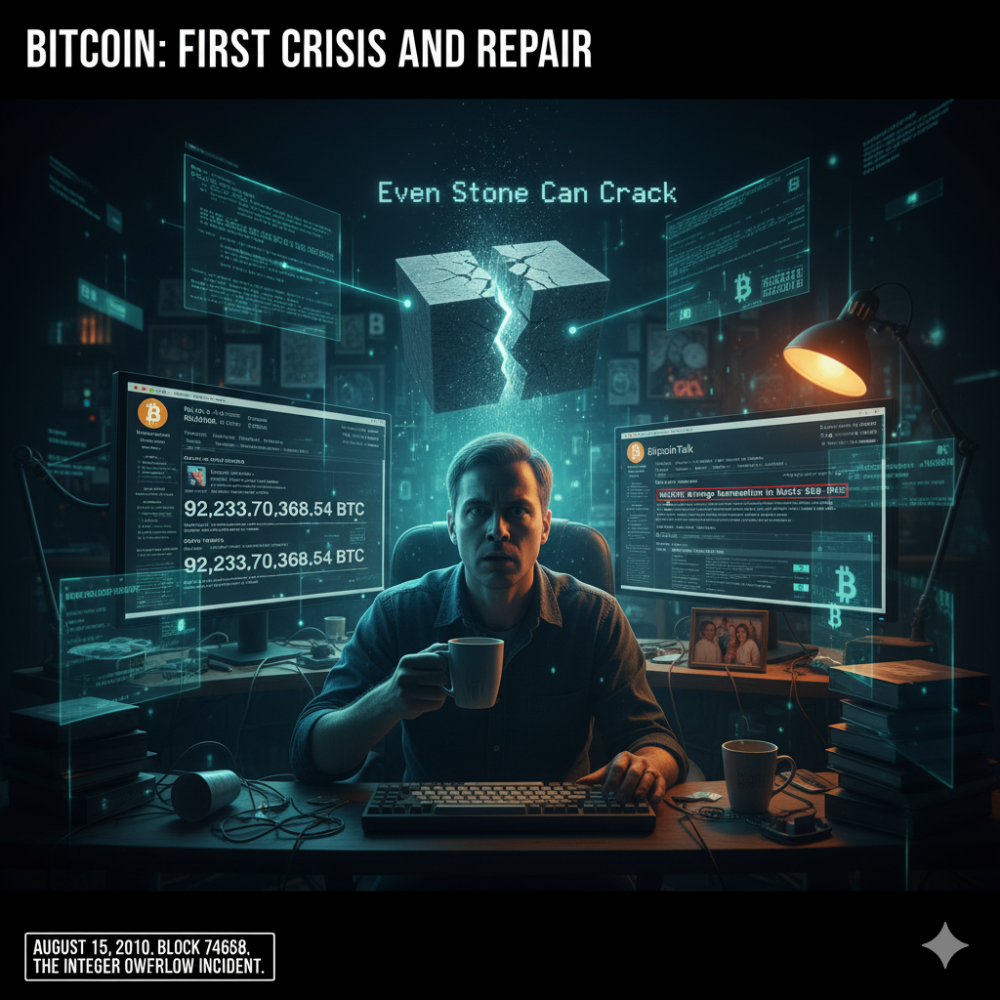

# First Steps: First Crisis and Fix

<picture>
  <source srcset="img_webp/09.webp" type="image/webp">
  
</picture>

> 💡 Witness Bitcoin's most heart-stopping 5 hours. On August 15, 2010, a code vulnerability nearly destroyed the entire Bitcoin network when 184.4 billion "fake coins" appeared on the blockchain out of nowhere. How did Satoshi Nakamoto and the community complete the boldest network rollback in history during this life-or-death moment? This was Bitcoin's crucial test transition from experiment to maturity, and the first life-or-death choice in decentralized governance.
> 
> Follow me on Twitter: [@bhbtc1337](https://twitter.com/bhbtc1337)
> 
> Join our WeChat discussion group: [Form Link](https://forms.gle/QMBwL6LwZyQew1tX8)
> 
> Open source on GitHub: [Stories-about-Bitcoin](https://github.com/beihaili/Stories-about-Bitcoin)

> *"The nature of Bitcoin is such that once version 0.1 was released, the core design was set in stone for the rest of its lifetime."*  
> *"But we learned that even stone can crack."*  
> ——Satoshi Nakamoto's reflection on the integer overflow incident

**📅 August 15, 2010, 5:00 PM Eastern Time**

This should have been a peaceful Sunday afternoon. The Bitcoin network had been running stably for 247 days, having processed nearly 80,000 blocks. The community was beginning to believe their "child" was mature and secure enough.

But on that seemingly ordinary summer day, a demon hidden deep in the code suddenly awakened, nearly dragging the entire Bitcoin network into irreversible abyss. Block height 74,638—a number that would be forever remembered.

## Demon Awakening: 184.4 Billion Fake Coins Appear

Eastern Time 17:00:03, block 74,638 was mined. This block seemed ordinary, containing two transactions with a total of 0.01 bitcoin in transaction fees. But when someone carefully examined the block contents, the numbers before their eyes made them doubt their vision: Output 1 was 92,233,720,368.54275808 bitcoins, Output 2 was also 92,233,720,368.54275808 bitcoins, totaling 184,467,440,737.09551616 bitcoins.

One hundred eighty-four billion bitcoins appeared on the blockchain out of nowhere. What was this concept? Bitcoin's designed total supply was 21 million coins—this sudden appearance was equivalent to 8,791 times the designed total! It was like the world's strictest central bank suddenly printing 8,000 times global GDP worth of banknotes overnight—any economist would know this meant complete collapse.

More terrifying was that the Bitcoin network actually accepted this transaction! All nodes verified it as valid, all miners considered it legitimate. The blockchain's most sacred rule—fixed total supply—was completely shattered by one line of careless code.

This vulnerability that nearly destroyed Bitcoin had a technical name: integer overflow. Imagine an old car's odometer that can only display up to 99,999 kilometers. What happens if the car actually travels 100,000 kilometers? The odometer resets directly to 00,000 and starts counting from zero again. Computers have similar limitations. In Bitcoin's early code, the variable used to verify transaction output sums used a 64-bit signed integer with a maximum value of 9,223,372,036,854,775,807.

The malicious transaction created two outputs, each being 92,233,720,368.54275808 bitcoins. When the system calculated the sum of both outputs, this number exceeded the 64-bit integer maximum, causing overflow and resulting in a very small positive number (actually 0.01 bitcoins)! The system saw total output as only 0.01 bitcoins, considered this a reasonable transaction, and happily accepted it. But actually, 184.4 billion "fake coins" had been written to the blockchain.

The vulnerability's core was: add first, check later. When overflow occurred during addition, checking had already failed.

## Community Shock and Heroes Emerge

Eastern Time 17:23, a programmer named Jeff Garzik was routinely checking the latest blocks. Jeff was an active Bitcoin community member with a special hobby: browsing the latest blocks daily like reading newspapers, studying the transaction records inside. He was particularly sensitive to abnormal transactions—this habit saved Bitcoin that day.

When Jeff opened the blockchain explorer and saw block 74,638's contents, he nearly dropped his coffee cup. 17:25, Jeff immediately posted an emergency thread on BitcoinTalk forum: "ALERT: strange transaction in block 74638," writing: "Guys, we have a serious problem! Someone just created 184 billion bitcoins in one transaction! Block 74638 contains 184,467,440,737.09551616 bitcoins in outputs. This is over 8000 times the total supply! What the hell happened?!"

This post was like dropping a nuclear bomb on a calm lake. Within 5 minutes of Jeff's post, forum traffic surged 500%. Usually lurking developers surfaced, newcomers panicked, servers were nearly overwhelmed by incoming users. Forum administrator Theymos immediately pinned the post and marked it "EMERGENCY," Gavin Andresen began verifying Jeff's discovery, major miner ArtForz suspended mining awaiting more information, and ailing Hal Finney sent concerned inquiries from his hospital bed.

Multiple developers independently verified this abnormal transaction: transaction ID 237fe8898a8ccbc653c970e3d3cbc6f6cafa609c89aa5e14f19b6fd188e3974e, block height 74,638, two abnormal outputs each worth 92233720368.54275808 bitcoins. Panic emotions began spreading: "Bitcoin is finished!" "What fixed total supply?" "We've been deceived!" "Who dares trust this system?" But there were also calm voices analyzing technical causes: "This is clearly an integer overflow bug" "Need immediate verification logic fix" "Might need to rollback the blockchain."

17:47, just as the community fell into chaos, a familiar name appeared on the forum: Satoshi. Satoshi Nakamoto was online. This was like Song Jiang suddenly appearing when Liangshan Marsh faced annihilation—all noisy voices instantly quieted. Everyone held their breath, waiting for this mysterious creator's instructions.

Satoshi's first reply showed his calmness in crisis: "This is a serious bug. The transaction verification code has an integer overflow vulnerability. The attacker created two outputs whose sum overflows, causing verification to erroneously pass. We need to fix this issue immediately." He quickly identified the problem's essence and began analyzing solutions.

After half an hour of analysis, Satoshi made a shocking decision: "We need to rollback the entire network." This statement exploded like a nuclear bomb on the forum. Rollback? That blockchain that always promoted "immutability" would now be "tampered with" by its own creator? The community immediately divided: supporters said "Satoshi is right, we have no choice," opponents said "This violates basic decentralization principles!" observers said "Let's see how exactly this works."

## 5-Hour Life-or-Death Battle: From Crisis to Rebirth

Satoshi began the most intense 2 hours of programming work in his career. He needed to locate the vulnerability, finding all places where integer overflow could occur; design repair solutions, redesigning transaction verification logic; write code, implementing safer verification algorithms; test verification, ensuring fixes wouldn't introduce new problems. The fixed code logic became: first check if individual outputs are legal, then check if addition would overflow, immediately reject if overflow detected, finally check if total value exceeds limits.

20:31, after nearly 3 hours of emergency development, Satoshi released the crucial update to save Bitcoin: "Bitcoin version 0.3.10 is released. URGENT: Please upgrade immediately." The community immediately began total mobilization. Gavin Andresen said at 20:35: "I've tested the patch. It works fine. Everyone needs to upgrade immediately. This is not a drill." Ailing Hal Finney supported from the hospital: "Even from my hospital bed, I can see this is the right approach. The community must unite during this crisis." Forum creator Sirius said: "I've upgraded my node and started mining on the clean chain. Join us!" ArtForz's support was crucial as the largest miner: "My mining farm is switching to version 0.3.10. Let's fix this mess together."

Upgrade progress was very rapid. By 21:00, 15% of nodes had upgraded; by 21:30, 40% completed upgrades; by 22:00, 65% of nodes ran the new version; by 22:30, 80% of the network was unified. From 17:00 when the malicious block was mined to 22:27 when the new "clean" chain regained dominance, the Bitcoin network experienced 8 hours and 27 minutes of split state.

Two competing chains appeared on the network: the old chain containing 184.4 billion fake coins continued extending, while the new chain restarted from block 74,637 and rejected the fake coin transaction. Hash power comparison showed dramatic transformation: at 17:00, the old chain had 100% hash power while the new chain had 0%; at 19:00, old chain 75% vs new chain 25%; at 20:00, old chain 60% vs new chain 40%; at 21:00, the new chain first led 55% to 45%; at 22:00, the new chain steadily led 80% to 20%; at 22:27, the new chain achieved complete victory 95% to 5%.

The turning point came at 21:00 when the new chain's hash power first exceeded the old chain—the entire community was excited. This meant most miners had stood on the "fix" side. Final victory came at Eastern Time 22:27:14 when the new chain mined block 74,639, officially surpassing the old chain to become the longest chain. All nodes running new software automatically switched to this "clean" chain. The 184.4 billion fake coins were completely deleted, as if they never existed.

## Crisis's Far-reaching Impact and Historical Significance

Many thought "rollback" was simply deleting several blocks, but actually this process was much more complex. The old block 74,638 (containing fake coins) wasn't "deleted" but "replaced" by a new, legitimate block 74,638—this was naturally achieved through the "longest chain" rule. The Bitcoin network always accepts the "longest valid chain" as true history: if two chains compete, the one with more hash power wins; when the new chain becomes longer than the old chain, all nodes automatically switch; this is a pure technical mechanism requiring no human intervention. The rollback only affected one block, all other transactions were protected, and no user funds were lost (except fake coins).

Though technically successful, this rollback sparked deep philosophical controversy. Supporters' reasons: "Without rollback, Bitcoin dies" "This is fixing bugs, not tampering" "Everyone agreed to do this." Critics' concerns: "What about promised immutability?" "One person can decide rollbacks?" "Will there be rollbacks again?" Satoshi responded: "I know this violates immutability principles, but the alternative is Bitcoin's death. Sometimes you must choose the lesser evil. I hope this is the first and last time."

This crisis spawned Bitcoin history's first formal emergency response mechanism. Warning systems established more sensitive anomaly detection, emergency contact networks for key developers, and rapid response decision processes. Code review became much stricter thereafter—every important line of code required multiple reviews: at least 3 developers review, unit test coverage above 90%, special testing for extreme values and exceptions, ensuring fixes don't introduce new bugs. Community governance prototypes also emerged during crisis handling: Satoshi provided technically authoritative solutions, the community conducted open transparent debate processes, miners and users "voted" with actions, implementing consensus through technical mechanisms rather than forced execution.

Heroes emerging during the crisis each played key roles. Satoshi as technical leader completed diagnosis, repair, and release within 5 hours, taking enormous reputation risks and showing excellent crisis leadership. Jeff Garzik as guardian was first to discover the anomaly—without his vigilance, consequences would have been unthinkable; he later became a Bitcoin core developer. Gavin Andresen as executor quickly verified and supported repair solutions, coordinated community response, showing future successor potential. Hal Finney as spiritual leader cared for the community despite illness, giving enormous moral support, embodying Bitcoin spirit's purity. ArtForz as hash power guarantee—the largest miner's support ensured rollback success, proving unity of economic rationality and technical idealism. Ordinary community members embodied collective wisdom—hundreds of node operators' cooperation, selfless voluntary upgrades and testing, demonstrating true decentralized power.

To commemorate this crisis, Bitcoin developers left permanent marks in code: writing "The infamous 'value overflow' incident of Aug 2010" in Bitcoin source code comments and recording overflow amount 184467440737.09551616. Blockchain traces were also permanently preserved—the fake coin transaction hash became an indelible part of Bitcoin history, reminding future generations how close crisis once came. In community culture, "Remember 74638" became developers' motto, August 15 annually became "Code Security Day," and integer overflow testing became standard procedure.

When we look back at that heart-stopping night, we find this wasn't just technical crisis handling but concentrated embodiment of Bitcoin community spirit. 17:00 crisis erupted with 184.4 billion fake coins appearing; 17:47 Satoshi appeared beginning technical analysis; 18:16 decided rollback taking enormous risk; 20:31 fix released starting rescue operation; 22:27 crisis resolved with Bitcoin reborn. In just 5 hours and 27 minutes, Bitcoin experienced a complete cycle from life to death to life again.

Those 5 hours proved what: code will never be perfect, but having ability to discover and fix problems is more important; decentralization doesn't equal anarchy—critical moments need technical authority leadership; community is more important than technology—when hearts unite, mountains move; ideals need realistic compromise—pure principalism might lead to disaster; crisis is the best teacher—painful experiences bring valuable growth.

From that night forward, Bitcoin was no longer a naive experimental project but grew into a mature system with powerful resilience. It learned to face crises, learned self-repair, learned to maintain balance between ideals and reality. Most importantly, it gained a community tested through life and death—a group willing to fight for shared ideals, able to unite at critical moments. This is Bitcoin's most precious wealth: not code, not algorithms, but human hearts.

As Hal Finney wrote in his post-crisis summary: "That was the most tense night since I participated in Bitcoin, but also the night that made me most proud. We proved that a group of people who had never met could unite for a common ideal and accomplish seemingly impossible tasks. Bitcoin's true value isn't in technology but in the human hearts that unite these technologies."

August 15, 2010, Bitcoin survived its first life-or-death ordeal. From this day forward, it was no longer Satoshi Nakamoto's personal experiment but became the entire community's shared endeavor. This crisis was like a coming-of-age ceremony, making Bitcoin transition from naivety to maturity, from fragility to resilience, from individual creation to collective guardianship. As the ancient saying goes: the sword's edge comes from grinding, plum blossoms' fragrance from bitter cold. After this crisis's baptism, Bitcoin finally grew into a truly powerful decentralized network.

---

*The "fake coin" amount in this integer overflow incident—184,467,440,737.09551616—was exactly the result of overflow after adding 1 to the maximum 64-bit signed integer value, indicating the attacker understood integer overflow principles very well. This number was later written into Bitcoin source code comments as permanent warning. More interestingly, block 74,638 now has two versions: the "evil" version containing fake coins and the "righteous" version after repair, becoming blockchain history's unique "parallel universe."*

---

<a href="../">🏠 Return to Homepage</a> | 
<a href="https://twitter.com/bhbtc1337">🐦 Follow Author</a> | 
<a href="https://forms.gle/QMBwL6LwZyQew1tX8">📝 Join Discussion Group</a>

