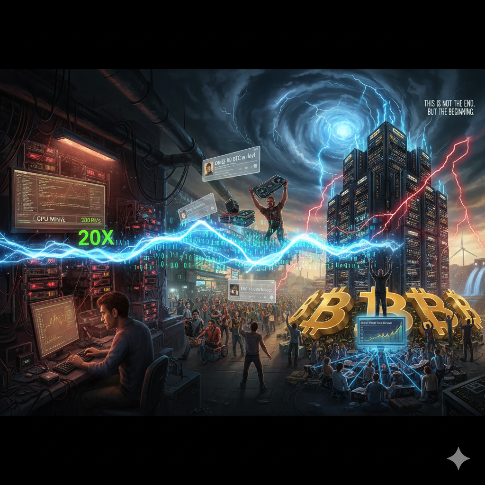

# Rising Storm: The Hashpower Revolution

<picture>
  <source srcset="img_webp/14.webp" type="image/webp">
  
</picture>

One late night in September 2010, while others were deep in sleep, Florida programmer Laszlo was pondering a problem in his basement workshop that kept him awake: why was Bitcoin mining so slow?

This legendary figure who bought pizza with 10,000 bitcoins would soon make another discovery that would equally change Bitcoin's destiny.

## The Pizza Guy's Genius Insight

Mining in 2010 was still in the stone age. Everyone was using CPU mining, including tech gods like Satoshi Nakamoto and Hal Finney. A high-end Intel processor running full throttle could calculate about 8 million hashes per second. This wasn't bad when Bitcoin was just born in 2009, but by late 2010, as more people joined the mining army, competition became extremely fierce.

Laszlo found that his several computers mining 24/7 might only mine a few bitcoins per day. This was unbearable for this technical perfectionist. When he deeply analyzed the characteristics of hash calculation, he suddenly had a flash of inspiration: wasn't this exactly what graphics cards were best at—parallel computing?

CPU was like a PhD student, could do anything, but wasn't fastest at anything. While GPU was like a thousand elementary students—though each wasn't as smart as the PhD, a thousand people working together would definitely be faster than one. Bitcoin mining was constantly calculating hash functions, each calculation completely independent, naturally suited for parallel processing.

One weekend in late September 2010, after several all-nighters of programming, Laszlo finally got his ATI graphics card running Bitcoin mining software. When the first performance test results came out, he could hardly believe his eyes:

**CPU Mining**: ~10 MH/s
**GPU Mining**: ~200 MH/s

20x performance difference! This meant a $200 graphics card had mining efficiency equivalent to 20 high-end CPUs worth $300 each.

## Graphics Card Shopping Frenzy

The spread of GPU mining news exceeded everyone's imagination. Laszlo didn't keep this discovery to himself, but published it completely open source on BitcoinTalk forum. Within just a few weeks, the Bitcoin community sparked a graphics card shopping frenzy.

Strange phenomena appeared in computer cities: graphics card buyers were no longer gamers, but groups of tech nerds talking about "hashpower" and "hash rates." They bought graphics cards in batches, some buying over ten at once.

"Are you a game developer?" salespeople asked.
"No, we mine."
"Mine what?"
"Bitcoin."
"What's that?"

Similar conversations played out repeatedly in computer malls worldwide. AMD found itself inadvertently becoming Bitcoin mining's biggest hardware supplier, while NVIDIA was somewhat annoyed to discover its products lacked competitiveness in this emerging market.

## The Golden Age of DIY Mining

From late 2010 to mid-2011 was the golden age of personal GPU mining. Mining then still maintained a strong DIY culture flavor. Miners weren't satisfied with simply buying equipment, but enthusiastic about various technical modifications and innovations.

BitcoinTalk forum's mining section became a large technical exchange platform, full of creativity:
- "My six-card mining rig, producing 50 BTC daily, posting pics for attention"
- "Cooling modification guide: How to keep graphics cards running full load 24/7 without throttling"
- "Remote monitoring solution: Mobile phone monitoring of mining rig status"

These posts usually came with various tech nerd style photos: open cases stuffed with graphics cards, huge cooling fans spinning loudly, dense wires and modified power supplies, looking like experimental lab equipment from sci-fi movies.

More creative miners began figuring out various optimization solutions: automatically adjusting fan speeds through temperature sensors, automatically starting/stopping mining programs based on electricity price periods, some even modified laptops for mobile mining.

## The Harsh Reality of Solo Mining

However, while GPU mining improved individual hashpower, it also brought an unexpected problem: drastically increased income uncertainty.

Bitcoin's reward mechanism was "winner takes all"—only miners who found blocks could get the 50 bitcoin reward, everyone else got nothing. This was like buying lottery tickets—might go months without anything, or might suddenly hit the jackpot one day.

BitcoinTalk forum began showing more and more complaints:
"Mined for four months without finding a block, paid over 2000 in electricity, going bankrupt at this rate"
"Big miners have too much hashpower, we small miners have no chance"
"Mining has completely become gambling, this is too far from Satoshi's vision"

At this critical moment, a programmer from Czech Republic proposed an innovative solution.

## Genius Collaborative Innovation

Marek Palatinus, username "slush," was a typical European tech geek. In late 2010, when he saw small miners' complaints, programmer instinct made him think about technical solutions.

Slush's idea was actually simple: since solo mining had unstable returns, why not pool everyone's hashpower together, mine collectively, then share rewards based on contribution?

On November 27, 2010, the world's first Bitcoin mining pool—Slush Pool—officially launched. Slush didn't have any grand launch ceremony, just posted a simple message on the forum: "I made a collaborative mining pool, everyone can try it."

The first batch of testing miners quickly discovered the mining pool's huge advantage: though individual rewards were diluted, there was daily income, no more relying on luck. A miner who could mine 0.1 bitcoin daily could stably get about 0.098 bitcoin daily in the pool.

Slush Pool's success exceeded everyone's expectations. Within just one month, the pool attracted hundreds of miners, with total hashpower reaching over 10% of the entire network. On December 16, 2010, Slush Pool mined its first block, marking the official beginning of the Bitcoin mining pool era.

## The First Crisis of Decentralization

But mining pools' rise also triggered the Bitcoin community's first deep debate about decentralization.

The core debate question was: did mining pools violate Bitcoin's decentralization principles?

Supporters argued that mining pools actually enhanced decentralization, allowing more small miners to participate in network maintenance. Opponents worried that if a few large mining pools controlled most of the network's hashpower, what difference was there from traditional centralized systems?

Satoshi himself remained relatively silent on the mining pool issue, but expressed subtle concern in a December 2010 forum reply: "I hope people won't over-rely on mining pools. Though it solves current problems, long-term we need better solutions."

This debate actually reflected different understandings of decentralization: technical decentralization vs. economic decentralization, equal outcomes vs. equal opportunities, ideal purity vs. practical feasibility. This debate didn't reach clear conclusions, but opened long-term discussions about governance philosophy in the Bitcoin community.

## Prelude to Technological Arms Race

While GPU mining and mining pool models were developing vigorously, some technically astute miners were already considering next-generation mining technology.

In the second half of 2011, FPGA (Field Programmable Gate Array) began entering Bitcoin miners' vision. FPGAs could be deeply optimized for specific algorithms, with significant advantages in both performance and power consumption. High-end FPGA chips performed 2-4 times better than same-priced GPUs in Bitcoin mining, with much lower heat generation than GPUs.

But FPGA mining faced practical obstacles: high prices, complex technical requirements, limited supply. More importantly, industry technical experts were already discussing FPGA's next stage: ASIC (Application Specific Integrated Circuit).

Once someone developed ASIC chips specifically for Bitcoin mining, both GPU and FPGA would be obsoleted. This prophecy soon became reality.

## The Rise of Electricity Economics

As mining competition intensified, miners gradually discovered hardware costs were no longer the only factor determining mining profitability. The real key variable was electricity costs.

Let's look at a specific example: a typical GPU mining setup in late 2011 cost about $3000 in hardware, but annual electricity costs could reach $1296. Considering hardware depreciation and maintenance costs, electricity might account for over 50% of total costs.

This cost structure spawned several important trends: miners began moving to regions with low electricity costs, western China became popular due to abundant hydropower resources, Nordic countries also became ideal due to cold climate and abundant green energy.

Bitcoin mining's massive electricity demand unexpectedly promoted renewable energy development. Much remote hydropower, wind power and other green electricity often couldn't be fully utilized, Bitcoin mining farms provided outlets for this "waste electricity."

## Deep Collision of Ideals and Reality

The hashpower revolution made the Bitcoin community deeply experience intense conflict between ideals and reality for the first time.

In the Bitcoin whitepaper, Satoshi described a "one-CPU-one-vote" decentralized voting system. But the hashpower revolution's result was professionalization, scaling, and centralization. A few large mining pools controlled most of the network's hashpower, ordinary users transformed from decision participants to observers.

This deviation triggered deep community reflection: opposition between technological determinism and humanistic care, choice between efficiency priority and fairness priority, balance between market logic and community governance.

Supporters believed technological development had its internal logic, any system would evolve toward greater efficiency. Critics argued that if technological development led to power concentration and social injustice, we needed institutional design to correct this deviation.

These debates had no standard answers, but they deeply shaped the Bitcoin community's values and development direction.

## Evolution's Inevitability and Choice's Wisdom

By the end of 2012, Bitcoin mining had completely transformed: hashpower improved from dozens of MH/s to thousands of MH/s, equipment upgraded from general computers to specialized mining equipment, scale developed from personal bedroom mining to professional mining farm operations.

More importantly were conceptual changes: mining was no longer a technical geek's hobby, but commercial activity requiring professional knowledge and large capital.

The hashpower revolution was Bitcoin history's first large-scale technological and social transformation. From Laszlo's GPU mining discovery to Slush's mining pool innovation, every node represented flashes of human wisdom. But these innovations also inevitably changed Bitcoin network's power structure and participation methods.

From a security perspective, the hashpower revolution greatly enhanced Bitcoin network security. From an economic perspective, mining industrialization created numerous jobs and opened new avenues for renewable energy utilization. From a technical perspective, professionalization and competition promoted rapid hardware technology development.

But perhaps the most important insight is: technological progress is a double-edged sword, the key isn't stopping progress, but guiding progress. The Bitcoin community's spirit of rational discussion, open tolerance, and continuous innovation during the hashpower revolution provided valuable experience for handling similar challenges.

As an old miner who participated in the entire hashpower revolution later summarized: "We lost some ideal purity, but we got a stronger, more practical, more valuable network. This trade was worth it, because only ideals that survive have the chance to change the world."

---

*Laszlo not only created the "pizza legend" in Bitcoin commercial history, but also pioneered the hashpower revolution. This programmer used practical actions to interpret what "practice brings true knowledge" means—whether using Bitcoin to buy pizza proving its monetary function, or using GPU mining proving its technical potential, all stemmed from deep understanding of technology's essence and bold experimentation.*