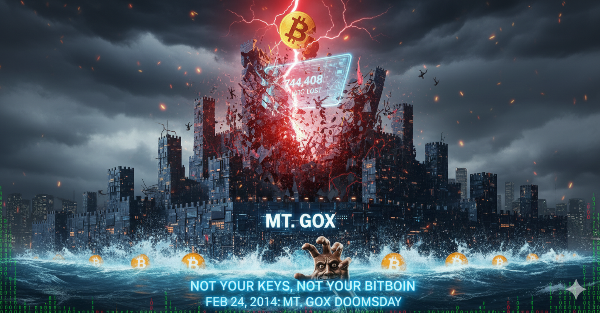

# Undercurrents: The Demise of Mt.Gox

<picture>
  <source srcset="../img_webp/19.webp" type="image/webp">
  
</picture>

On February 7, 2014, in an office in Tokyo's Shibuya district, Marc Karpelès, the once-proud creator of a digital empire, now stared pale-faced at the flickering numbers on his computer screen. Three years earlier, he was the hero who built a Bitcoin trading empire with technical genius and business intuition; now, he was about to become the culprit of the biggest disaster in cryptocurrency history.

The numbers before him made his heart sink: 850,000 Bitcoins, worth approximately $470 million, had vanished into thin air.

This was not just a crisis for one exchange, but a fatal blow to the entire Bitcoin world. From its origins as a Magic card website, through the baptism of hacker attacks, to once dominating global Bitcoin trading, the Mt.Gox empire was about to collapse.

## The Empire's Hidden Flaws Emerge

After years of rapid development, Marc Karpelès's Mt.Gox empire was handling over 70% of global Bitcoin transactions, becoming the de facto "Bitcoin bank." However, beneath the seemingly impregnable surface of this digital empire, the hidden flaws planted in the early days were quietly fermenting.

Although the 2011 hacker attack crisis was successfully resolved, the problems exposed by that incident were never truly addressed. The system architecture remained fragile, internal management remained chaotic, and risk control remained blank. More dangerously, success made Karpelès even more arrogant—he believed technology could solve all problems, rejected external professional advice, and insisted on autocratic management.

By 2013, Mt.Gox had grown from 8 employees managing thousands of users to dozens of people managing hundreds of thousands of users. But this expansion was more like "scale amplification" rather than "system upgrade." The originally simple system designed for small-scale trading now had to bear global financial-level trading pressure. It was like assembling an F1 racing car with bicycle parts—it would inevitably disintegrate at high speed.

A former employee later recalled: "We repeatedly suggested completely restructuring the system and establishing modern risk control mechanisms, but Mark always said the current system was running well and there was no need for major changes. He seemed to forget that system operation and system security are two different things." This technical arrogance planted a time bomb for the impending disaster.

## The Crisis Erupts

In the second half of 2013, users began reporting withdrawal delays. Initially attributed to slow bank processing and regulatory requirements, the delays became increasingly severe: days turned into weeks, weeks into months, and large withdrawals were indefinitely suspended. In December 2013, "Bitcoin Jesus" Roger Ver conducted a "field inspection" of Mt.Gox and released a video endorsing it, claiming the withdrawal issues were only temporary technical difficulties. This endorsement temporarily calmed the market but was based on incomplete information. The death spiral had already begun: using new user funds to pay old user withdrawals, a typical Ponzi scheme.

On February 7, 2014, Mt.Gox suddenly suspended all Bitcoin withdrawals, issuing a technical statement claiming to have discovered a Bitcoin protocol "transaction malleability" vulnerability, attempting to shift responsibility to Bitcoin itself. Industry experts immediately refuted this. Bitcoin Core developer Greg Maxwell pointed out: "Transaction malleability attacks may cause accounting confusion but won't lead to Bitcoin actually disappearing. If Mt.Gox lost large amounts of Bitcoin due to this, it can only mean their accounting system has fundamental flaws." This technical explanation was more like a smokescreen, trying to cover up more serious internal problems.

On February 24, a document allegedly from inside Mt.Gox began circulating online—"Crisis Strategy Draft," detailing the real predicament: 744,408 customer Bitcoins and approximately $28 million in cash, with the company actually bankrupt. The document showed: "Over the past few years, due to theft-related losses, the company has lost 744,408 BTC and $28,200,000 in cash." The more shocking truth: these losses may have continued for years, with Mt.Gox constantly using new user funds to pay old user withdrawals. Investigative journalists found that Karpelès may have known about the funding shortage long ago but chose to hide the truth, hoping to make up for losses through other means.

On February 28, 2014, the Mt.Gox website suddenly became a blank page with only a brief statement: "Facing recent news reports and ongoing DDoS attacks, Mt.Gox needs to temporarily close all trading..." But this "temporary closure" was permanent. Hours later, Mt.Gox filed for bankruptcy protection in the Tokyo District Court. Bankruptcy data: 744,408 customer Bitcoins lost, 100,000 own Bitcoins lost, with a total value of approximately $470 million. Bitcoin prices instantly plummeted by over 30%, from $600 to below $400, with global panic selling sweeping the market.

In the Tokyo courtroom, Karpelès in a black suit bowed to the media and apologized: "I deeply apologize for the losses caused to users. We will do our utmost to cooperate with the investigation and work to restore user funds." But for users who lost their life savings, this apology was pale and powerless.

## The Cost and Lessons of Disaster

The damage Mt.Gox's bankruptcy caused to users is difficult to quantify. A German software engineer: "I put all my savings into Bitcoin, all stored on Mt.Gox. Now I've lost everything and don't know how to explain to my wife and children." A Japanese retired teacher: "I converted half my retirement fund into Bitcoin and stored it on Mt.Gox, hoping to preserve value for my grandson's education expenses. I wanted to leave an education fund for my grandson, but now I've brought disaster to the family." An American college student: "I worked part-time for two years to buy Bitcoin, all stored on Mt.Gox. Now not only is my tuition uncertain, but I'm also in debt." These are not numbers, but destroyed lives.

Mt.Gox's demise taught the Bitcoin community the most important lesson. Centralization risk: No matter how large an exchange is, it can collapse. Storing Bitcoin with a third party equals giving up control, and centralization violates Bitcoin's original intention of decentralization. Technical lessons: Hot wallet storage of large amounts of Bitcoin is extremely dangerous, lack of transparent financial management is a fatal flaw, and financial institutions without audit mechanisms are untrustworthy. Philosophical reflection: Bitcoin's original intention was to let people control their own assets. Storing Bitcoin on exchanges violates this intention. Decentralization should not stop at technology but should also be reflected in usage methods.

From the ashes of Mt.Gox, the golden rule of the Bitcoin world was born: "Not Your Keys, Not Your Bitcoin."

## Rebirth and Reflection

Although Mt.Gox's demise was a disaster, it also promoted industry maturity. Technological progress: Multi-signature wallets became popular, cold storage technology was standardized, exchange security standards were raised, and transparency and audit mechanisms were established. Regulatory development: Countries began formulating cryptocurrency regulations, exchange licensing systems were established, and customer fund protection mechanisms were improved. User education: Self-custody wallet usage increased, vigilance against centralized platforms improved, and risk management awareness was enhanced. Cultural change: From "trust institutions" to "verify everything," emphasizing personal responsibility and self-custody, deepening the concept of decentralization.

Mt.Gox's story is a fable about trust and betrayal, ideals and reality. It reminds us: technological innovation without governance innovation will repeat the mistakes of traditional finance. Bitcoin was born to let people control their own assets, and Mt.Gox's existence precisely violated this original intention. Its collapse was punishment for deviating from the original intention and a call to return to the source.

In a sense, Mt.Gox's demise was not Bitcoin's failure but a victory of Bitcoin's spirit—it taught the world what true decentralization means. History doesn't repeat, but it always rhymes. When we see various centralized platform problems today, Mt.Gox's lessons still ring loud and clear: true freedom begins with controlling your own private keys.

---

*Interestingly, after years of legal proceedings following Mt.Gox's bankruptcy, Bitcoin began being returned to creditors in 2021. Due to Bitcoin price increases, some victims from that year ultimately recovered asset values that even exceeded their original losses. But this unexpected "happy ending" cannot offset the pain of that year, nor can it become a reason to ignore risk management.*
