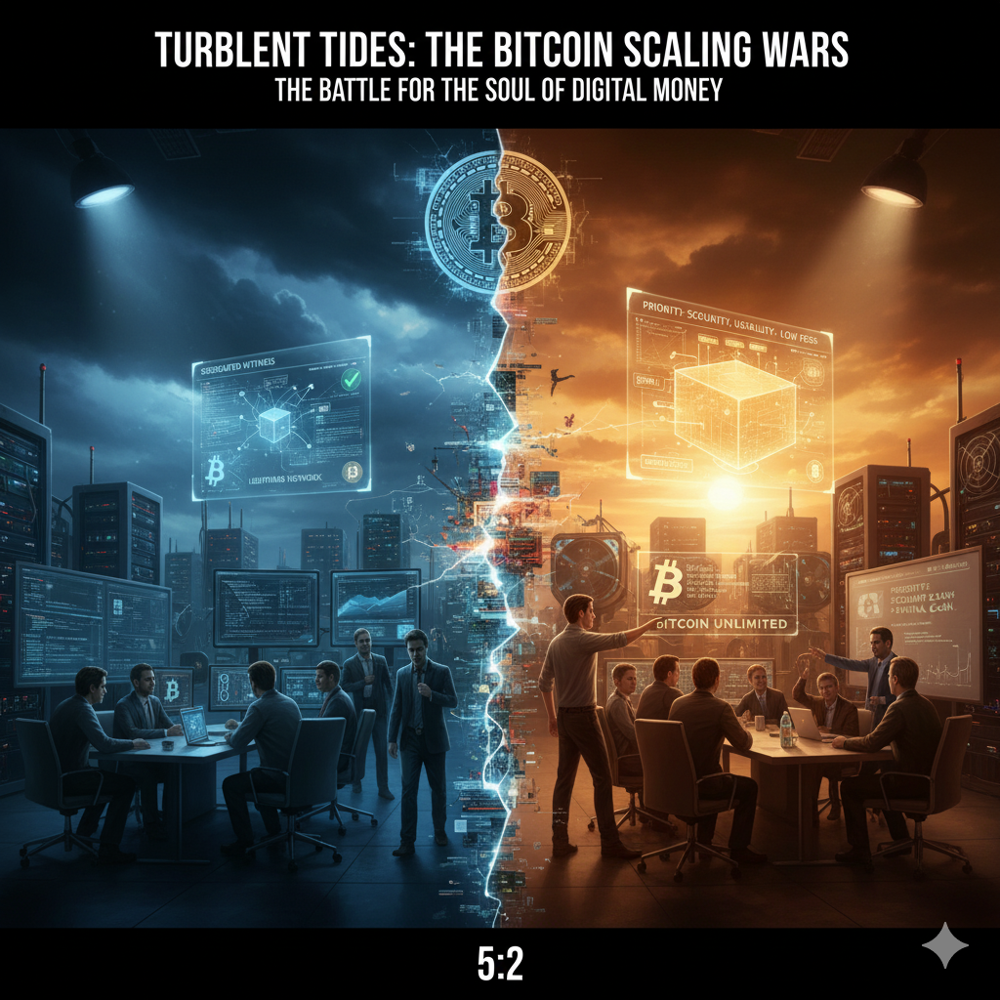

# Breaking Waves: The Scaling War Intensifies

<picture>
  <source srcset="../img_webp/22.webp" type="image/webp">
  
</picture>

In the spring of 2017, in an upscale coffee shop in Manhattan, New York, a hedge fund manager was trying to pay for a latte with Bitcoin. The transaction had been waiting in the mempool for three hours, still unconfirmed. The fee was set too low—only $10, while the network's average fee had soared to over $50.

"This is ridiculous," he complained to his colleague, "we're investing in a payment system, but we can't even buy a cup of coffee."

This was not an isolated case. In 2017, the Bitcoin network was mired in an unprecedented congestion crisis, with technical problems evolving into an ideological war that tore the entire community apart. There was no middle ground, no room for compromise. This was a decisive battle for Bitcoin's future.

## The Crisis Moment of Network Congestion

In early 2017, Bitcoin network congestion reached unprecedented severity: over 200,000 transactions per day were waiting for confirmation in the mempool, average confirmation times extended from minutes to hours, some transactions needed to wait days before being included by miners, and average fees soared from a few cents to over $50.

User pain index exploded: Coinbase received thousands of transaction delay complaints daily, BitPay found small payments completely unfeasible, and a $5 coffee required a $20 fee to be confirmed promptly.

BitPay CEO Stephen Pair wrote in a blog post: "This completely violates Bitcoin's original purpose as a payment system."

Worse still, this created a vicious cycle: Bitcoin's rising price attracted more users, exacerbating congestion; high fees made Bitcoin lose its viability for daily payments.

Scaling was no longer a technical issue that could be discussed slowly, but a survival crisis that needed immediate resolution.

## Philosophical Divergence of Two Technical Routes

The Bitcoin community split into two distinctly different technical camps, which was not just a debate over technical solutions but a fundamental divergence over Bitcoin's essence.

**Small Block + Layer 2 Route (Bitcoin Core)**

Core philosophy: Bitcoin's primary value is as a secure, decentralized value storage system

Technical stance: Strictly control block size, maintain 1MB limit; increase capacity through SegWit (Segregated Witness); Layer 2 solutions (Lightning Network) handle daily payments; prevent ordinary users from being unable to run full nodes.

Luke Dashjr (Core senior developer) argued: "If we simply increase block size, the cost of running full nodes would rise dramatically. Eventually, only large companies and governments could run nodes, and Bitcoin would lose its decentralized characteristics."

Vision: Bitcoin is "digital gold," with the main chain as a value settlement layer, and daily payments conducted on second-layer networks.

**Large Block Route (Bitcoin Unlimited)**

Core philosophy: Bitcoin's value lies in providing cheap, fast payment services for the world

Technical stance: Remove 1MB block size limit; let the market freely determine optimal block size; miners find balance based on network conditions and economic incentives; prioritize user experience and practicality.

Roger Ver ("Bitcoin Jesus") stated: "Satoshi's vision was a peer-to-peer electronic cash system, not a settlement network. We need Bitcoin that can handle global transactions, not an expensive settlement system that only serves the wealthy."

Vision: Bitcoin is "digital cash," with the main chain directly processing large volumes of daily transactions.

Fundamental divergence: Digital gold vs digital cash? Security first vs usability first?

## Bitcoin Unlimited's Technical Challenges

Facing the Core team's insistence on SegWit, the large block camp launched their own solution.

Bitcoin Unlimited (BU) design philosophy: Remove 1MB block size limit, users set acceptable maximum block size, miners set block size they're willing to mine, find optimal equilibrium through market mechanisms.

Peter Rizun (BU chief scientist) wrote in a technical white paper: "Block size limits are economic problems, not technical problems. We believe the market can find optimal solutions better than any central planner."

BU gained support from major mining pools like ViaBTC and Antpool, with Chinese miners particularly supportive, once obtaining over 40% of hash power support.

But in March 2017, the BU client had serious bugs, with BU nodes frequently crashing. These technical problems raised questions about the BU team's ability to maintain Bitcoin infrastructure.

Peter Todd (Core developer) sharply commented: "BU's bugs prove a point: maintaining the Bitcoin protocol requires extremely high technical expertise, not something anyone can handle."

## The New York Agreement: Corporate Compromise Attempt

On May 22, 2017, in a conference room on the 57th floor of the New York Marriott Hotel, Manhattan's skyscrapers sparkled in the sunset outside the window. Barry Silbert looked at the contract before him and took a deep breath. As founder of Digital Currency Group, he knew today's signing ceremony might change Bitcoin's fate.

"Gentlemen," Silbert stood up and scanned the CEOs in the conference room, "what we're doing today will be written into Bitcoin's history."

The room was filled with representatives from 58 of Bitcoin's most important companies: Coinbase's Brian Armstrong, BitPay's Stephen Pair, Blockchain.info's Peter Smith, Xapo's Wences Casares. These people controlled most of the Bitcoin ecosystem's economic activity.

"The SegWit2x solution is simple," Silbert continued, "first activate SegWit to solve technical problems, then increase block size to 2MB within six months to meet capacity needs. This is a win-win solution."

Brian Armstrong was the first to pick up a pen and sign. "Finally, someone stepped up to end this meaningless argument," he said. Other CEOs followed suit, and the sound of pens scratching paper filled the conference room.

When the last signature was completed, Silbert breathed a sigh of relief. From the data, they had obtained overwhelming support: 58 companies controlled most Bitcoin transaction volume, and over 80% of miner hash power expressed support.

But what Silbert didn't expect was that in IRC chat rooms thousands of miles away, Bitcoin Core developers were engaged in heated discussions. The world of technology and the world of business had completely different rules of the game.

## Developers' Angry Counterattack

When news of the New York Agreement signing reached the developer community, Matt Corallo was writing code at his home computer. When he saw the news, he almost dropped his coffee cup.

"This is a joke," Corallo typed in Bitcoin Core's IRC channel, "58 businessmen in suits decided Bitcoin's future in a luxury hotel in New York? They didn't even invite a single developer to participate!"

Soon, other Core developers joined the discussion. Gregory Maxwell's response was even sharper: "Hard forks are high-risk operations requiring extremely careful planning and execution. SegWit2x's timeline is too tight, with no time for adequate testing. Do these businessmen treat Bitcoin as their private property?"

Luke Dashjr published a long article in the mailing list: "The New York Agreement represents not Bitcoin users but corporate interests. The participating companies, though influential, represent a much broader user base. Ordinary users, developers, and researchers have no voice in the agreement."

This opposition quickly evolved into a fundamental conflict of governance philosophy. The corporate camp believed economic power should determine technical direction—after all, they were driving Bitcoin's actual applications. The Core camp insisted that technical expertise and community consensus should determine development direction—Bitcoin's value lay in decentralization, not being controlled by a few large companies.

In Blockstream's office, Adam Back told his colleagues: "If we let businessmen decide Bitcoin's technical route, what decentralization does Bitcoin have left? Next, will they decide the mining algorithm?"

This divergence made executing the New York Agreement extremely complex. On paper, companies and miners supported the agreement, but without the Core team's cooperation, implementing SegWit2x was almost impossible. Code doesn't automatically update because of business agreements.

## Full-Scale Civil War in the Digital World

The New York Agreement controversy spread through the Bitcoin community like a virus, tearing the originally unified community into hostile camps.

On Reddit's r/Bitcoin subreddit, moderators began deleting any posts supporting SegWit2x. "This is censorship!" a user angrily wrote, "we need a place for free discussion." Thus, the r/btc forum was born, specifically for discussing scaling issues, quickly gathering tens of thousands of users.

Twitter became the most intense battlefield. Hundreds of tweets about scaling appeared daily, with supporters and opponents attacking each other. The @bitcoin account, controlled by Roger Ver, daily posted content supporting large blocks, engaging in fierce battles with the Core supporter army.

"Core developers are Blockstream's puppets!" Ver wrote in a tweet.

"Roger Ver betrayed Bitcoin's decentralization philosophy!" a Core supporter countered.

Technical discussions gradually evolved into personal attacks. Labels like "surrender faction," "traitors," and "dictators" flew everywhere, with rational voices drowned out by extreme emotions. Some developers received death threats for expressing different viewpoints.

In a Cambridge coffee shop, a Core developer told a friend: "I just want to write code to make Bitcoin better. But now I wake up every day to face hundreds of abusive messages. I'm starting to consider whether I should quit this project."

This chaotic state began affecting Bitcoin's market performance. Investors lost confidence in governance failure, and price volatility intensified. Some companies originally planning to invest in Bitcoin-related projects began hesitating.

"If the Bitcoin community can't even reach consensus on a technical upgrade," a venture capitalist said in an internal meeting, "can we still expect it to become global financial infrastructure?"

## The Cost of Decentralization

In a coffee shop in Palo Alto, California, two economics professors were discussing Bitcoin's governance crisis.

"This is the cost of decentralization," one said, "no central authority means difficulty in rapid decision-making. Look at the US Congress—even the simplest bills require endless debate."

The other nodded in agreement: "The problem is that technical controversies easily evolve into political controversies. What started as a technical discussion about 1MB vs 2MB has now become a philosophical debate about Bitcoin's essence."

This dilemma could be felt at Bitcoin gatherings worldwide. At a Tokyo gathering, a Japanese developer said: "Technical decisions require professional knowledge, but professional elites shouldn't monopolize decision-making power. The question is, how to balance technical rationality with community democracy?"

At another gathering in Shanghai, a Chinese miner offered a different perspective: "We've invested millions of dollars in equipment and bear the burden of network security. Why can some developers who've never mined decide our fate?"

This divergence exposed Bitcoin governance's fundamental tension: the conflict between economic interests and technical ideals. Companies need to pursue short-term commercial interests, developers insist on long-term technical vision, and miners must consider returns on hash power investments. These three forces are indispensable but difficult to coordinate.

More complex is that Bitcoin is a global system, with vastly different user needs across regions. US users might care more about privacy and censorship resistance, while users in developing countries care more about low-cost payment functionality. Regulatory environments also influence technical choices—what's legal in the US might be banned in China.

## Calm Before the Storm

In the summer of 2017, on Los Angeles' Sunset Boulevard, a Bitcoin investor sat in traffic, nervously scrolling through Bitcoin news on his phone. The scaling war had entered a white-hot stage, with new controversies and conflicts daily.

Three major camps had already positioned themselves: the Core camp insisted on the SegWit + small block route, believing technical elegance was more important than crude scaling; the corporate camp pushed the SegWit2x compromise solution, hoping to find balance between technical upgrades and business needs; and in the distance, the large block camp was plotting an even more radical plan.

In developer offices worldwide, code was being quietly written. Some were preparing soft forks, some were preparing hard forks, and others were preparing complete separation. Technical weapons were in place, waiting for the right moment.

Community sentiment was at a breaking point. On the BitcoinTalk forum, rational technical discussions were almost nowhere to be seen, replaced by factional opposition and mutual attacks. Old friends severed ties over different technical viewpoints, and developers who had cooperated for years publicly broke apart.

At a Bitcoin gathering in San Francisco, an early user lamented: "I've been using Bitcoin since 2011, witnessing its growth from an experimental project to a global phenomenon. But I never imagined it would face such severe division over a technical controversy."

Another attendee responded: "Perhaps this is the price of growth. Bitcoin is no longer a niche geek project; it now involves billions of dollars in interests and millions of users' needs. Conflict is inevitable."

Ironically, just as the Bitcoin community was fiercely debating "digital cash" vs "digital gold," Bitcoin's price soared from $1,000 at the beginning of the year. Speculators flooded the market, completely unconcerned about technical route controversies. For them, Bitcoin was just an investment tool, and whether it was 1MB or 2MB didn't affect their trading decisions.

Bitcoin was facing the most severe governance crisis since its inception. The outcome of this scaling war would not only determine Bitcoin's technical route but also redefine the meaning of decentralized governance.

Summer was ending, and the moment of decisive battle was approaching. No one knew how this war would end, but everyone knew that Bitcoin's history was about to turn a new page.

---

*The 58 signing companies of the SegWit2x New York Agreement represented over 85% of the Bitcoin ecosystem's economic activity at the time, but ultimately proved that economic power cannot forcibly drive technical change, becoming a classic case of decentralized governance.*
