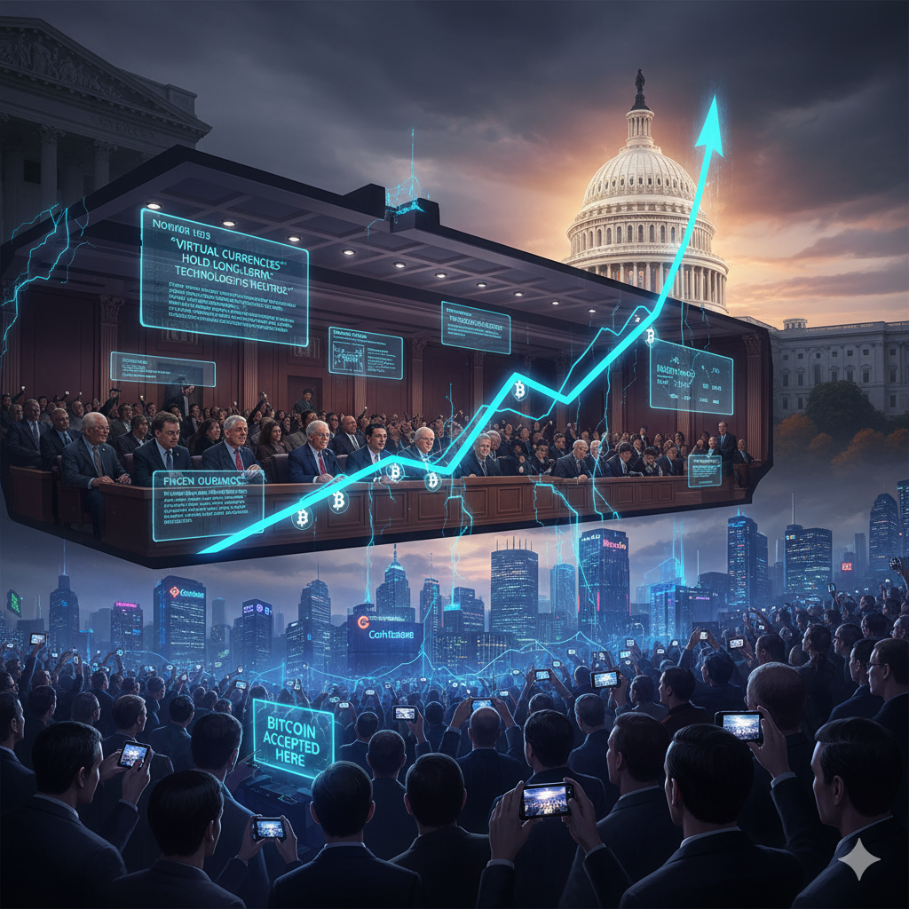

# 暗潮汹涌：华盛顿的审视

<picture>
  <source srcset="../img_webp/17.webp" type="image/webp">
  
</picture>

2013年11月18日，华盛顿特区的国会山笼罩在秋日的薄雾中，但哈特参议院办公大楼的216室却异常热闹。这间通常只有政策专家和游说者光顾的听证会会议室，今天吸引了来自世界各地的记者、比特币爱好者和金融分析师。

会议室外的走廊里，身穿西装的华尔街银行家与穿着T恤的比特币开发者并肩而坐，这种组合在华盛顿实属罕见。所有人都在等待同一个问题的答案：美国政府究竟如何看待这个新兴的数字货币？

## 伯南克的意外表态

会议开始前一天，一份文件悄然在比特币社区传播开来，引发了巨大的轰动。这是美联储主席本·伯南克提交给参议院的书面证词。在这份措辞谨慎但态度明确的文件中，伯南克写道：

"虚拟货币可能具有长期前景，特别是如果创新促进了更快、更安全和更高效的支付系统。"

这句话如同投入平静湖面的巨石，瞬间激起千层浪花。要知道，伯南克是全球金融体系的守护者之一，他的每一个字都会被市场仔细解读。对于一个长期被视为挑战传统货币体系的技术，美联储主席竟然表达了相对积极的态度。

比特币中国的创始人杨林科在北京的办公室里看到这个消息时，几乎不敢相信自己的眼睛。"这意味着什么？"他问自己的团队。"这意味着美国政府不打算禁止比特币，至少现在不会。"

伯南克的表态背后有着深层的考量。作为经济学博士，他深知技术创新对经济发展的重要性。同时，作为央行行长，他也必须平衡创新与稳定的关系。这份证词体现了美国监管哲学的核心：既不扼杀创新，也不忽视风险。

但伯南克的支持并非无条件的。在证词中，他明确指出了美联储的三个主要关切：消费者保护、反洗钱合规和国际协调。

## 执法部门的实用主义

如果说伯南克的表态让比特币社区感到意外的话，那么FBI的态度则更加令人震撼。在听证会上，FBI副局长发表了一份同样措辞谨慎但立场明确的证词。

"比特币和其他虚拟货币为合法的金融交易提供了便利，"他说道，"但它们也被犯罪分子用于洗钱、毒品交易和其他犯罪活动。我们的重点不是技术本身，而是如何防止其被滥用。"

这种"技术中性"的立场在FBI内部并非一致意见。据知情人士透露，在丝绸之路案件调查期间，FBI内部对比特币的看法存在严重分歧。一派认为应该严厉打击，另一派则认为应该区别对待技术和应用。最终，实用主义的声音占了上风。

FBI特别提到了丝绸之路的关闭："我们成功关闭丝绸之路并逮捕其运营者的事实证明，比特币并非完全匿名。通过适当的调查技术，我们完全有能力追踪数字货币的流向。"

这个表态具有双重意义：一方面，它向犯罪分子发出警告，比特币并不是犯罪的避风港；另一方面，它向合法用户传达了一个信息，只要遵纪守法，政府不会干预正常的比特币使用。

## FinCEN的历史性认定

比听证会更重要的是，美国财政部金融犯罪执法网络（FinCEN）在2013年3月18日发布了一份指导意见，首次明确了比特币在美国的法律地位。

文件的核心内容可以用一句话概括：比特币交易所和某些比特币服务提供商被定性为"货币服务商"，需要在FinCEN注册并遵守相关的反洗钱法律。

这个认定看起来技术性很强，但实际意义重大。它意味着美国政府承认了比特币的"准货币"地位，同时也明确了监管的边界。个人使用比特币进行日常交易不需要特殊许可，但经营比特币交易业务则需要合规。

Coinbase的创始人布赖恩·阿姆斯特朗得知这个消息后，立即召集团队开会。"这是我们一直在等待的确定性，"他对员工们说道。"现在我们知道了游戏规则，就可以按照规则来玩。"

FinCEN的认定也带来了成本。合规需要大量的资源投入，包括律师费、合规人员薪酬和系统建设成本。许多小型比特币服务商因为无法承担这些成本而退出市场，但这也为那些有实力的公司创造了机会。

## 市场的狂欢反应

华盛顿的这一系列积极表态引发了比特币市场的疯狂反应。听证会前一周，比特币价格还在200美元左右徘徊，但随着伯南克证词的泄露和听证会的召开，价格开始了一场令人目眩的攀升之旅。

11月18日听证会当天，比特币价格突破了500美元。三天后，价格达到了700美元。感恩节后的第二天，价格突破了1000美元大关，创造了历史新高。整个十一月，比特币价格上涨了近400%。

这种价格表现吸引了全球媒体的关注。《华尔街日报》发表了题为《比特币价格飙升背后的华盛顿因素》的深度报道。文章指出："监管明朗化消除了比特币面临全面禁令的担忧，为其大规模采用扫清了障碍。"

投资者的情绪也发生了微妙变化。过去投资比特币主要靠信仰，现在开始有了政策支撑。对冲基金经理迈克尔·诺沃格拉茨在接受CNBC采访时说："华盛顿的表态给了我们投资比特币的信心。现在我们知道政府不会突然禁止它，这大大降低了投资风险。"

## 合规交易所的崛起

监管明朗化的最大受益者是那些早早开始合规建设的交易所。Coinbase在FinCEN指导意见发布后不久就完成了注册，成为美国首批合规的比特币交易所之一。

阿姆斯特朗回忆道："2013年是Coinbase发展的关键年份。当其他交易所还在观望政策走向时，我们已经开始按照最严格的标准建设合规体系。这个决定虽然在当时增加了成本，但最终证明是正确的。"

合规不仅仅是技术问题，更是商业策略问题。Coinbase聘请了前高盛副总裁作为合规主管，并与多家银行建立了合作关系。这些努力让Coinbase在竞争中脱颖而出，奠定了其在美国比特币市场的领导地位。

相比之下，那些拒绝合规的交易所则面临越来越大的压力。Mt.Gox虽然仍然是全球最大的比特币交易所，但其在美国市场的份额正在被Coinbase等合规交易所蚕食。

## 监管框架的初步轮廓

华盛顿的这一系列动作勾勒出了美国比特币监管框架的初步轮廓。这个框架有三个特点：多机构协调、渐进式监管和创新友好。

多机构协调体现在不同监管机构的分工明确：FinCEN负责反洗钱监管，SEC可能负责证券相关的数字资产，CFTC可能负责商品和衍生品，而各州政府则负责货币传输业务许可。

渐进式监管体现在政策的逐步完善。政府没有一开始就制定全面的法律框架，而是通过指导意见、执法行动和政策声明逐步明确规则。

创新友好体现在对技术本身的积极态度。伯南克的证词明确表达了对支付创新的支持，FBI的表态也强调了技术中性原则。

## 国际影响与示范效应

美国的积极表态对全球其他国家产生了重要影响。作为全球金融中心和技术创新中心，美国的政策选择往往具有示范效应。

英国金融行为监管局的一位官员在伦敦接受采访时说："美国的做法为我们提供了重要参考。既然美联储都认为虚拟货币可能有长期前景，我们也应该认真研究如何在保护消费者的前提下促进创新。"

加拿大也在美国听证会后不久宣布了类似的监管框架。但并非所有国家都选择跟随美国的做法。中国在12月5日发布了更加严格的政策，形成了与美国的鲜明对比。

## 新时代的开始

2013年11月的华盛顿听证会标志着比特币发展进入了一个新阶段。从这一刻开始，比特币不再是一个边缘的技术实验，而是一个受到政府认可的金融创新。

但这种认可是有条件的。政府对比特币的支持建立在其遵守现有法律框架的基础上。这意味着比特币社区必须学会在创新和合规之间找到平衡。

华尔街的投资银行家们开始认真研究比特币的投资价值，传统金融机构开始考虑是否应该提供比特币相关服务，普通消费者开始询问如何安全地购买和存储比特币。所有这些变化都源于华盛顿的那一纸表态。

当11月的夜晚降临华盛顿时，国会山的灯火依然明亮。在那些灯火下，政策制定者们正在讨论一个他们几年前还闻所未闻的技术。他们知道，这个技术可能会改变整个金融体系，而他们的决定将影响这种改变的方向和速度。

历史将证明，2013年11月18日不仅是比特币发展的重要节点，也是人类金融史的重要转折点。从这一天开始，数字货币不再是乌托邦，而是现实；不再是威胁，而是机遇；不再是边缘，而是主流。

在哈特参议院办公大楼的216室里，一扇通向未来的大门悄然打开了。

---

*美国参议院的那次听证会记录至今仍保存在国家档案馆中，见证了数字货币从争议走向认可的历史转折。*
